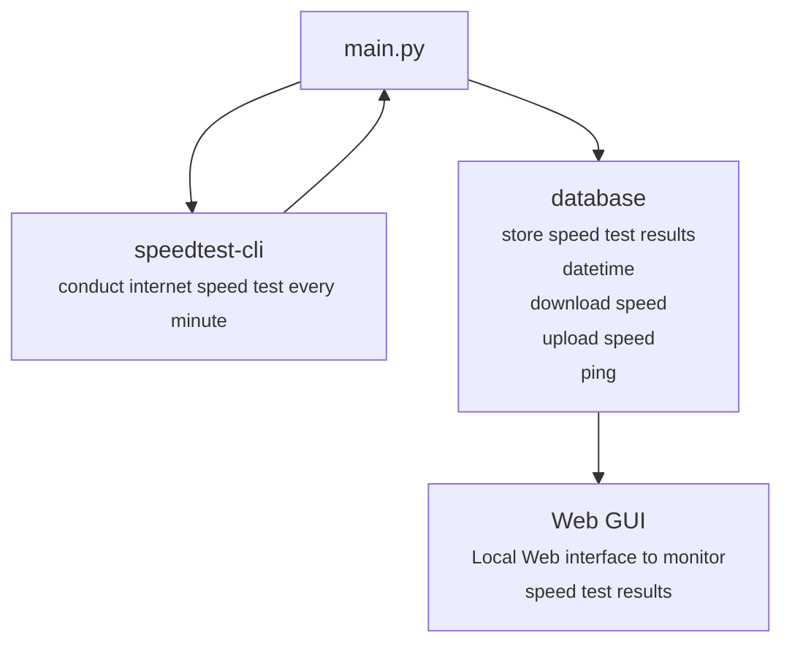

# pyinternetspeedtest
An internet speed test monitor.

**pyinternetspeedtest** will conduct a internet speed test using **speedtest-cli**. Then it will save test values into a **sql database**. User can monitor internet performance from a local webpage hosted on **node red**.

## Hardware Information
Hardware: **Raspberry Pi 4 Model B** <br>
OS: **Raspbian Buster Lite**

## Code Flowchart


## Installation
### Update Raspberry Pi
```
sudo apt update 
sudo apt upgrade
```

### Install Git
```
sudo apt install git
```

### Install speedtest-cli
```
sudo pip3 install speedtest-cli
```

### Install MariadB
```
sudo apt install mariadb-server
sudo pip3 install mysql-connector-python==8.0.29
```


### speedtest-cli

