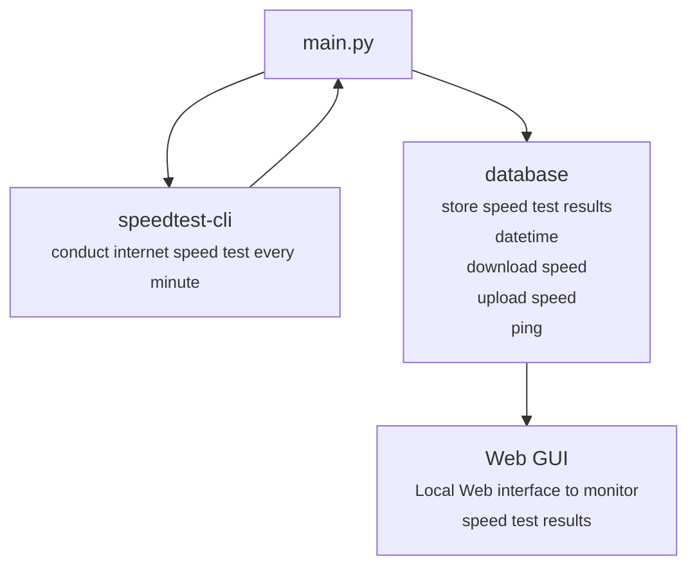

# pyinternetspeedtest
An internet speed test monitor.

**pyinternetspeedtest** will conduct a internet speed test using **speedtest-cli**. Then it will save test values into a **sql database**. User can monitor internet performance from a local webpage hosted on **node red**.

## Hardware Information
Hardware: **Raspberry Pi 4 Model B** <br>
OS: **Raspbian Buster Lite**

## Code Flowchart


## Installation
### Update Raspberry Pi
```
sudo apt update 
sudo apt upgrade
```

### Install Git
```
sudo apt install git
```

### Install Python Pip
```
sudo apt install python3-pip
```

### Install speedtest-cli
```
sudo pip3 install speedtest-cli
```

### Install MariadB
```
sudo apt install mariadb-server
sudo pip3 install mysql-connector-python==8.0.29
```

### Install Node-Red
```
bash <(curl -sL https://raw.githubusercontent.com/node-red/linux-installers/master/deb/update-nodejs-and-nodered)
```

## Setting Up
### Mariadb
1. **root** Access
```
sudo mysql_secure_installation
```
2. Connect with **root**
```
sudo mysql -uroot -p<password>
```
3. Useful commands to **Mariadb** 

**Database Commands**
```
SHOW DATABASES; ---> List current databases

CREATE DATABASE <Database_name>; ---> create new database

USE <database_name>; ---> access to database

```

** Table Commands**
```
SHOW TABLES; ---> List current tables in database

CREATE TABLE <Table_name>; ---> Create new table

DESCRIBE <Table_name>; ---> Describe columns in table

SELECT * FROM <Table_name>; ---> Show values in table
```

4. Create **new user**
```
CREATE USER '<username>'@'localhost' IDENTIFIED BY '<password>';
```
5. Grant Privileges to **new user** to **new database**
```
GRANT ALL PRIVILEGES ON <dbname>.* TO '<username>'@'localhost';
```
6. Reload permissions
```
FLUSH PRIVILEGES;
```
7. Test connection with **new user**
```
sudo mysql -u<username> -p<password>
USE <Database>;
```

### Node-Red Dashboard
1. Configure Node-Red (source: https://nodered.org/docs/getting-started/raspberrypi)
```
node-red-pi --max-old-space-size=256
```
 To quite enter `crtl+c` <br><br>
Setting File Dir: `/home/<username>/.node-red/settings.js`<br><br>

2. Autostart on boot (source: https://nodered.org/docs/getting-started/raspberrypi)
```
sudo systemctl enable nodered.service
sudo systemctl start nodered.service
sudo systemctl status nodered.service
```

3. Accessing GUI Editor/Dashboard

**Editor Address**
```
IP_Address:1880
```
**GUI Address**
```
IP_Address:1880/ui
```

4. Download required packages on Node-Red

To download, access `admin interface > setting dropdown (top right corner) > manage pallete > install`

**Search the following modules**
```
node-red-dashboard
node-red-contrib-stackhero-mysql
node-red-contrib-ui-artless-gauge
```

5. Edit Dashboard Login Credentials

Edit **setting.js** with an editor.
```
nano /home/<user>/.node-red/setting.js
```

Uncomment **adminAuth**


**Example**

Username = user

Password = password (Generate using **Bcrypt Hash** - example: https://bcrypt-generator.com/)

6. Importing Flow 
Import **flows.json** into Dashboard. `options (top right corner), Import > Select a file to import`


7. Configuring Flow

To configure **Maria DB** access, double click on the db node, then access the setting via the **edit** button. 


Edit the following parameters.
```
Host: 127.0.0.1
Port: 3306
User: <username>
Password: <password>
Database: wan
```

8. To create database table, **internet**, click on the create button in the flow (**red circle**).


9. To change GUI to **dark mode**

Click on arrow button (top right corner)
`dashboard > theme > style > Dark`

### Setting up Complete
<br><br>

## Logging onto GUI
Go to the following ip address
```
ip_address:1880/ui
```

Below is a sample of the GUI

