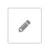

# Node-Red Dashboard

## Install (nodeJs & node-red)
1. sudo apt update
2. sudo apt upgrade
3. bash <(curl -sL https://raw.githubusercontent.com/node-red/linux-installers/master/deb/update-nodejs-and-nodered)

## Starting locally on CLI

 node-red-pi --max-old-space-size=256
source: https://nodered.org/docs/getting-started/raspberrypi

## Autostart on boot
sudo systemctl enable nodered.service
sudo systemctl start nodered.service
source: https://nodered.org/docs/getting-started/raspberrypi

## Accessing Editor/UI
Editor default : address:1880
UI default : address:1880/ui

## Required Packages on Node-Red
To download, via admin interface > settings dropdown on top right corner > manage pallete > install (search the modules)

1. node-red-dashboard
2. node-red-contrib-stackhero-mysql
3. node-red-contrib-ui-artless-gauge

## Authentication config for Editor
After starting node-red on CLI (see above), one of output lines contains the address to the settings file.

In this case it would be
 /home/greendot/.node-red/settings.js

Edit the file and find the code under Security > adminAuth, uncomment the code block.

Default username = admin
Default password = password, to change use bcrypt to hash and copy into the code block accordingly

source: https://nodered.org/docs/user-guide/runtime/securing-node-red

## Importing Flow
From options on top right corner, Import > Use json file or copy the json code into and import

## Configuring Flow
To configure MariaDB access, double click on the db node, then access the settings via the edit button

 

host : 127.0.0.1
username/password/database name to be set

Click update

To create database table, click on the create button in the flow 

or manually create a table via sql query using these settings/query:

CREATE TABLE `internet` ( 
`epoch` varchar(15) not null,
`download` float not null,
`ping` float not null,
`upload` float not null);

To change the color theme of the dashboard to dark, click on arrow button near top right corner > dashboard > theme > style > dark

Finally, click deploy on top right corner to finalize changes
